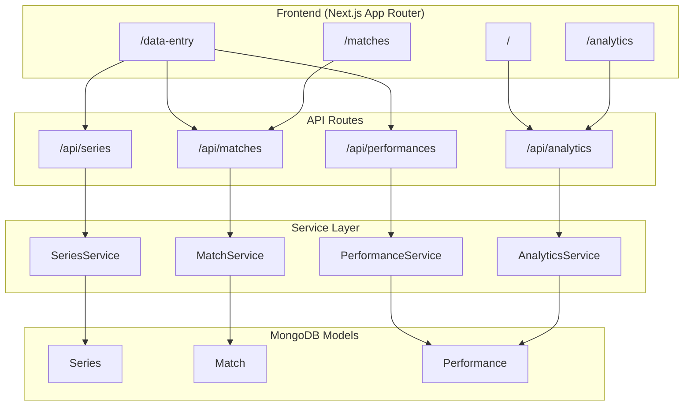

# Cricket Career Analytics Dashboard

## Overview

A complete cricket career analytics dashboard for **Sudhanshu Shekhar** built with Next.js 15, TypeScript, MongoDB, and Chart.js.

---

## Architecture



### Derived Fields Logic

| Category | Field | Formula |
|----------|-------|---------|
| **Batting** | Strike Rate | `(Runs / Balls) × 100` |
| | Boundary % | `((Fours × 4 + Sixes × 6) / Runs) × 100` |
| **Bowling** | Economy | `Runs Conceded / Overs` |
| | Balls Bowled | `Full Overs × 6 + Partial Balls` |
| **Fielding**| Dismissals | `Catches + Run Outs + Stumpings` |

### Career Aggregates

The `AnalyticsService` handles complex MongoDB aggregation pipelines to calculate:
- **Win %** across all formats
- **Highest Scores** and **Best Bowling Figures** (per match & innings)
- **Milestone counts** (50s, 100s, 3W/5W hauls)
- **Trend Data** (Running averages and strike rates)

---

## File Structure

```
src/
├── app/
│   ├── api/
│   │   ├── analytics/route.ts      # Career summary, trends, breakdowns
│   │   ├── matches/
│   │   │   ├── route.ts            # List & create matches
│   │   │   └── [id]/route.ts       # Get, update, delete match
│   │   ├── performances/
│   │   │   ├── route.ts            # Get & upsert performance
│   │   │   └── [id]/route.ts       # Delete performance
│   │   └── series/
│   │       ├── route.ts            # List & create series
│   │       └── [id]/route.ts       # Get, update, delete series
│   ├── analytics/page.tsx          # Analytics dashboard with charts
│   ├── data-entry/
│   │   ├── page.tsx                # Data entry hub
│   │   ├── match/
│   │   │   ├── page.tsx            # Match list & create
│   │   │   └── [id]/page.tsx       # Performance entry
│   │   └── series/page.tsx         # Series management
│   ├── matches/page.tsx            # Match history
│   ├── layout.tsx                  # Root layout with Navbar
│   └── page.tsx                    # Dashboard home
├── components/
│   ├── charts/
│   │   ├── ChartConfig.tsx         # Chart.js configuration
│   │   ├── Charts.tsx              # All chart components
│   │   └── index.ts
│   ├── forms/
│   │   ├── MatchForm.tsx           # Match metadata form
│   │   ├── PerformanceForms.tsx    # Batting/Bowling/Fielding sections
│   │   ├── SeriesForm.tsx          # Series form
│   │   └── index.ts
│   ├── layout/
│   │   └── Navbar.tsx              # Navigation bar
│   └── ui/
│       └── Card.tsx                # Card & StatCard components
├── lib/
│   ├── constants.ts                # Player info, enums
│   ├── models/
│   │   ├── Match.ts                # Match schema
│   │   ├── Performance.ts          # Performance schema with derived fields
│   │   ├── Series.ts               # Series schema
│   │   └── index.ts
│   ├── services/
│   │   ├── analytics.service.ts    # Aggregation pipelines
│   │   ├── match.service.ts        # Match CRUD
│   │   ├── performance.service.ts  # Performance CRUD
│   │   ├── series.service.ts       # Series CRUD
│   │   └── index.ts
│   └── utils.ts                    # Utility functions
├── types/
│   └── index.ts                    # TypeScript interfaces
└── database/
    └── mongoose.ts                 # DB connection
```

---

## Features Implemented

### 1. Data Entry System

| Feature | Description |
|---------|-------------|
| **Series Management** | Create, view, delete series/tournaments |
| **Match Entry** | Create matches with venue, opponent, result |
| **Performance Entry** | Tabbed interface for batting/bowling/fielding |
| **Multi-Innings Support** | Test/First-class matches have 4 tabs for both innings |
| **Partial Saves** | DNB/DNB checkboxes for each section |

### 2. Analytics Dashboard

| Chart | Type | Description |
|-------|------|-------------|
| Runs Over Time | Line | Cumulative and per-match runs |
| Average Trend | Line | Running batting average |
| Strike Rate Trend | Line | Running strike rate |
| Economy Trend | Line | Running economy rate |
| Wickets Per Match | Bar | Wickets in each match |
| Format Breakdown | Doughnut | Runs/wickets by format |
| Opponent Stats | Bar | Performance vs opponents |
| Recent Form | Bar | Last 10 matches |

### 3. Derived Fields

Automatically calculated on save:

**Batting:**
- Strike Rate, Boundary Runs, Boundary %
- isFifty, isCentury, isDuck, isNotOut flags

**Bowling:**
- Balls Bowled, Economy, Strike Rate, Average
- is3W/4W/5W Haul flags

**Match Level:**
- matchRuns, matchWickets (sum of innings)
- Total fielding dismissals

### 4. Filters

All analytics support filtering by:
- Match format (T20, ODI, Test, etc.)
- Level (International, IPL, Domestic, etc.)
- Date range
- Opponent
- Venue

---

## Usage Guide

### Adding Your First Match

1. Go to **Data Entry** → **Manage Matches**
2. Click **+ New Match**
3. Fill in match details (format, venue, opponent, etc.)
4. Click **Create Match**
5. You'll be redirected to the performance entry page
6. Use tabs to enter batting, bowling, fielding stats
7. Click **Save Performance**

### Adding a Series

1. Go to **Data Entry** → **Manage Series**
2. Click **+ New Series**
3. Fill in series name, format, dates, teams
4. Click **Create Series**
5. When creating matches, select this series

### Viewing Analytics

1. Go to **Analytics** page
2. Use filters to narrow down by format, level, or date
3. View charts and detailed stats tables
4. Format-wise and opponent-wise breakdowns available

---

## API Endpoints

### Series
| Method | Endpoint | Description |
|--------|----------|-------------|
| GET | /api/series | List all series |
| POST | /api/series | Create series |
| GET | /api/series/[id] | Get single series |
| PUT | /api/series/[id] | Update series |
| DELETE | /api/series/[id] | Delete series |

### Matches
| Method | Endpoint | Description |
|--------|----------|-------------|
| GET | /api/matches | List matches (with filters) |
| POST | /api/matches | Create match |
| GET | /api/matches/[id] | Get single match |
| PUT | /api/matches/[id] | Update match |
| DELETE | /api/matches/[id] | Delete match + performance |

### Performances
| Method | Endpoint | Description |
|--------|----------|-------------|
| GET | /api/performances?matchId=X | Get performance |
| POST | /api/performances | Create/update performance |
| DELETE | /api/performances/[id] | Delete performance |

### Analytics
| Method | Endpoint | Description |
|--------|----------|-------------|
| GET | /api/analytics?type=summary | Career summary |
| GET | /api/analytics?type=format | Format breakdown |
| GET | /api/analytics?type=trends | Trend data |
| GET | /api/analytics?type=opponents | Opponent stats |
| GET | /api/analytics?type=venues | Venue stats |
| GET | /api/analytics?type=all | All analytics |

---

## Running the Application

```bash
# Development
npm run dev

# Production build
npm run build
npm start
```

---

## Build Verification

✅ **Build Status:** Compiled successfully

```
✓ Compiled successfully in 1659ms
✓ Generating static pages (14/14)

Routes:
○ /                     - Dashboard
○ /analytics            - Analytics page
○ /data-entry           - Data entry hub
○ /data-entry/match     - Match management
ƒ /data-entry/match/[id]- Performance entry
○ /data-entry/series    - Series management
○ /matches              - Match history
ƒ /api/*                - API routes
```

---

## Next Steps (Optional Enhancements)

1. **More Charts**: Venue analysis, batting position analysis
2. **Export**: CSV/PDF export of career stats
3. **Comparison**: Compare performance across seasons
4. **Mobile Optimization**: Better mobile responsiveness
5. **Data Import**: Import data from cricket websites